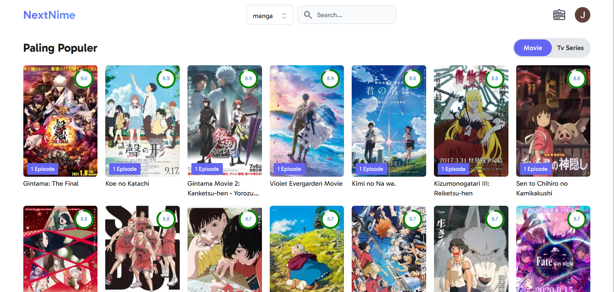
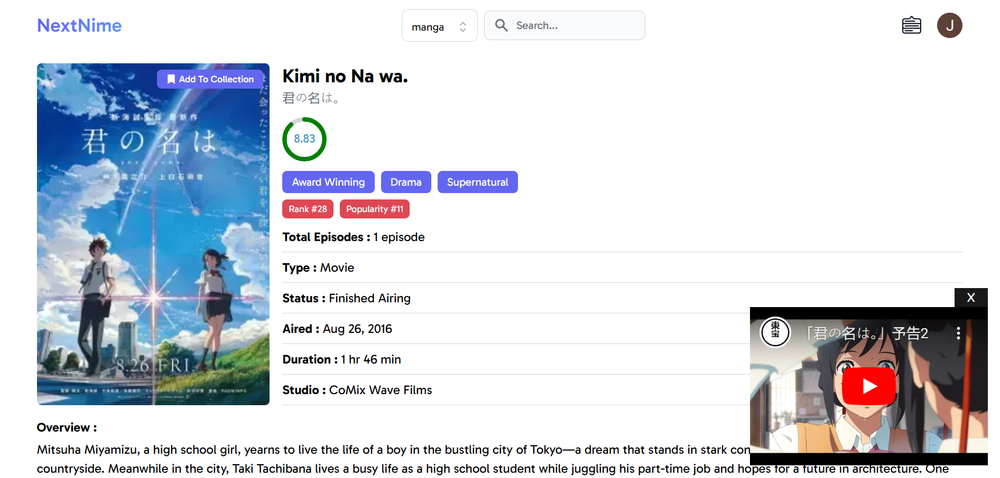

<h1>Nextnime</h1>

This project is a website designed to showcase detailed information about various anime, manga, including descriptions, genres, ratings, chapters and episodes. Users can search for their favorite anime and manga, view detailed information, and save them to a personalized watchlist.

<h2>Features</h2>

<ul>
	<li><strong>Discover:</strong> Find various anime manga.</li>
	<li><strong>Collection:</strong> Users can save their favorite anime and manga.z</li>
	<li><strong>Comment:</strong> There is a comment feature.</li>
	<li><strong>Search:</strong> Easily find anime or manga using our intuitive search feature.</li>
  	<li><strong>Authentication:</strong> Google OAuth and credential</li>
</ul>

<h2>Technical Stack</h2>

<h3>Fullstack</h3>

<ul>
	<li><strong>Language:</strong> TypeScript</li>
	<li><strong>Framework:</strong> Nest.js</li>
	<li><strong>ORM:</strong> Prisma</li>
	<li><strong>Database:</strong> Supabase PostgreSQL</li>
	<li><strong>Stayling:</strong> Tailwind - ShadcnUI</li>
</ul>

<h2>Demo Website</h2>

<a href="https://nextnime.vercel.app" target="_blank">View Demo Website Here</a>

## Api

<a href="https://jikan.moe" target="_blank">Jikan API - UNOFFICIAL MYANIMELIST API</a>
