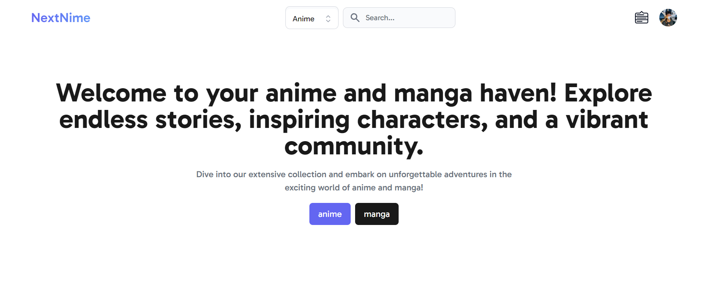
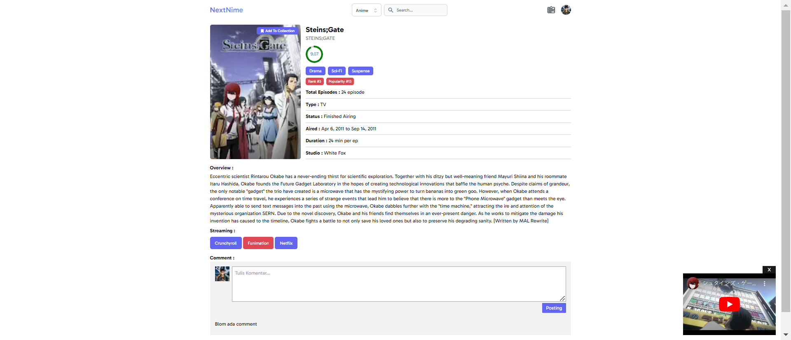

# NextNime

## Description

[NextNime](https://nextnime.vercel.app/) is an anime project used to search for a list of anime and manga. Here, you can find information about a specific anime or manga.

## Screenshot

Here we have project screenshot:

## Demo

<a href="https://nextnime.vercel.appbackend">View Demo Website Here</a>

## Technical Stack

<h3>Backend</h3>

<ul>
	<li><strong>Language:</strong> TypeScript</li>
	<li><strong>Framework:</strong> Next.js</li>
	<li><strong>ORM:</strong> Prisma</li>
	<li><strong>Database:</strong> PostgreSQL</li>
	<li><strong>Infrastructure:</strong> Supabase</li>
	<li><strong>Authentication:</strong> NextAuth.js</li>
</ul>

<h3>Frontend</h3>

<ul>
	<li><strong>Language:</strong> TypeScript</li>
	<li><strong>Framework:</strong> Next.js</li>
	<li><strong>Stayling:</strong> TailwindCSS</li>
</ul>

<h3>Library</h3>

<ul>
	<li><strong>react-circular-progressbar</strong></li>
	<li><strong>react-icons</strong></li>
	<li><strong>react-youtub</strong></li>
	<li><strong>bcrypt</strong></li>
	<li><strong>headlessui/react</strong></li>
</ul>
